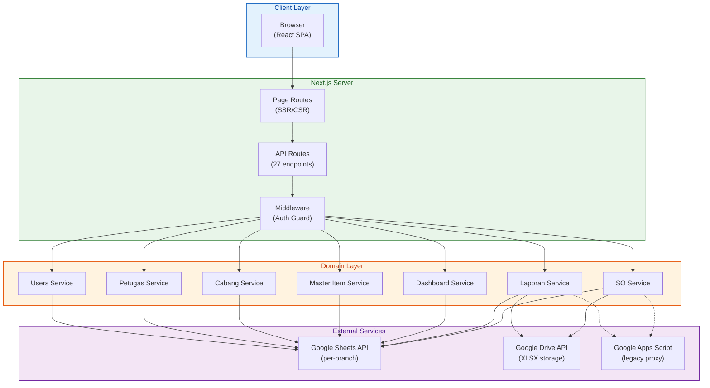
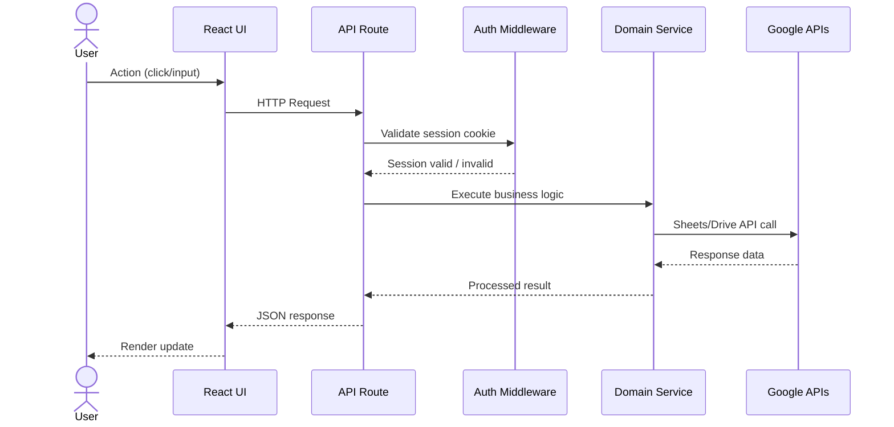
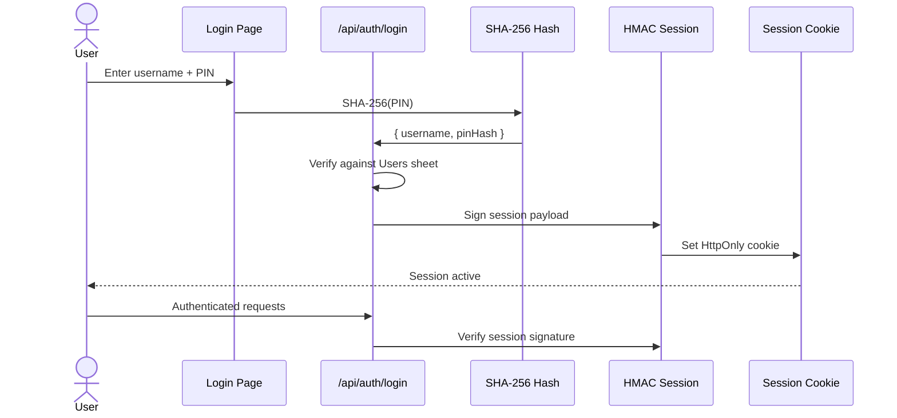
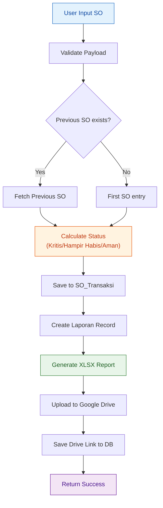
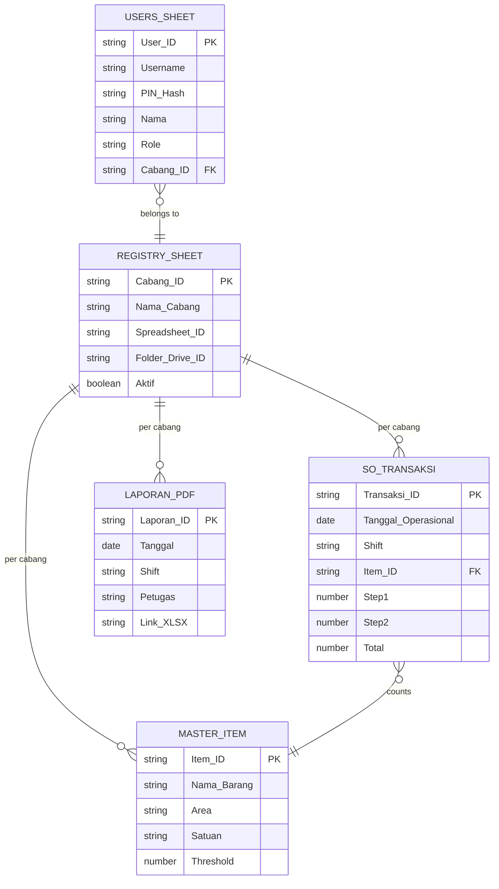
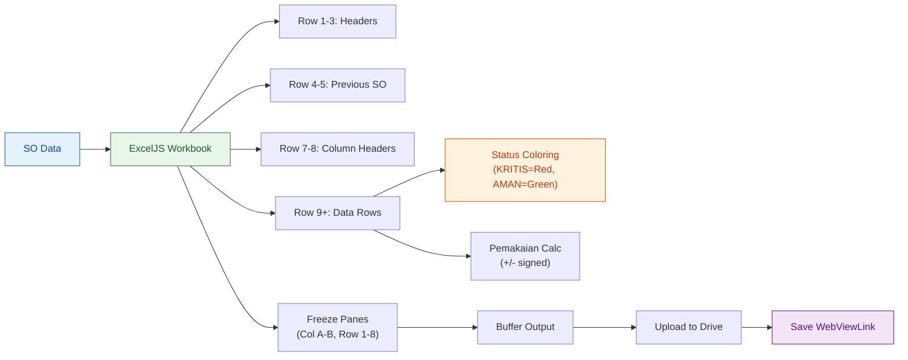
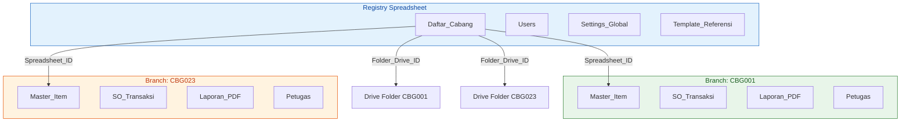
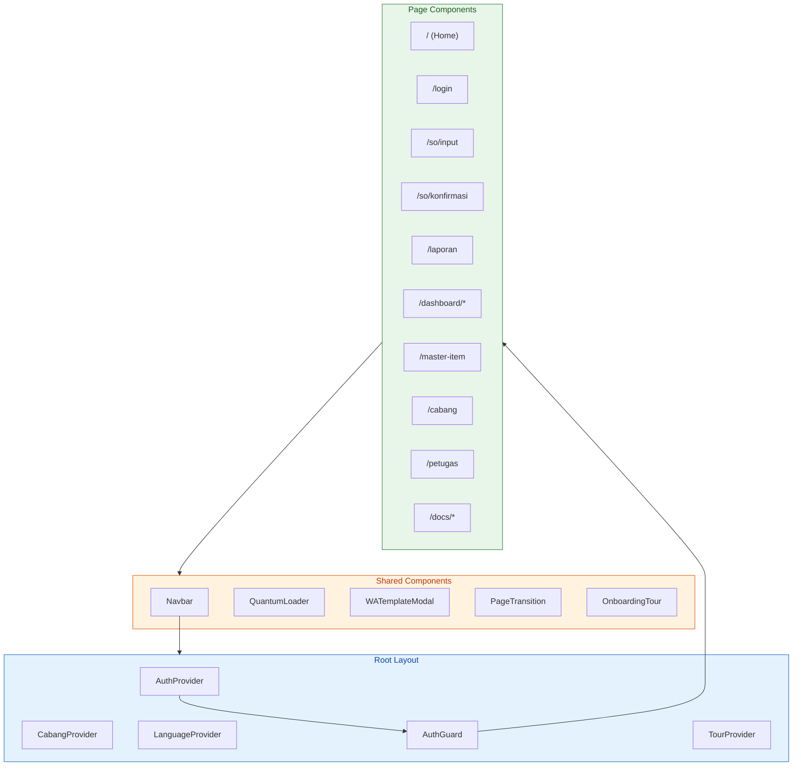

# Architecture

## High-Level System Overview

## Request Flow

## Authentication Flow

## Stock Opname Data Flow

## Google Sheets Data Model

## XLSX Report Generation

## Branch Isolation Model

## Component Architecture

