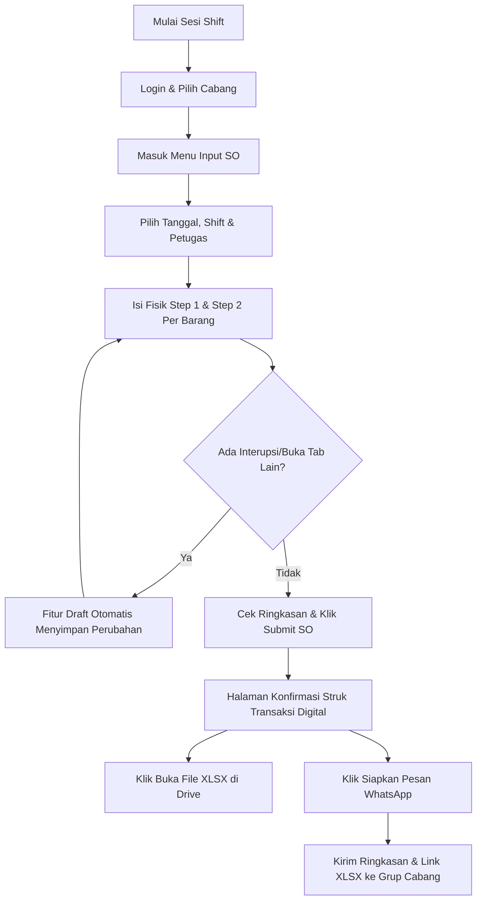

# 📖 PANDUAN PENGGUNAAN & MANUAL TRAINING OPERASIONAL APLIKASI STOKIS (MOCHIKIN)

Selamat datang di **Aplikasi Stokis (Mochikin)**! Dokumen ini dirancang sebagai panduan pelatihan dan operasional lengkap (end-to-end) bagi seluruh staf cabang, kepala cabang, supervisor, hingga owner/admin pusat dalam menjalankan prosedur Stock Opname (SO) harian berbasis data digital terintegrasi.

---

## 📌 DAFTAR ISI
1. [Pendahuluan & Tujuan Sistem](#1-pendahuluan--tujuan-sistem)
2. [Peran & Hak Akses User (Roles)](#2-peran--hak-akses-user-roles)
3. [Alur Kerja Operasional Harian (Workflow Sesi SO)](#3-alur-kerja-operasional-harian-workflow-sesi-so)
4. [Panduan Modul & Fitur Aplikasi](#4-panduan-modul--fitur-aplikasi)
   - [4.1 Login & Pemilihan Cabang](#41-login--pemilihan-cabang)
   - [4.2 Dashboard Monitoring (Harian & Mingguan)](#42-dashboard-monitoring-harian--mingguan)
   - [4.3 Form Input Stock Opname (SO)](#43-form-input-stock-opname-so)
   - [4.4 Halaman Konfirmasi (Struk Transaksi Digital)](#44-halaman-konfirmasi-struk-transaksi-digital)
   - [4.5 Riwayat Laporan & Filter Search](#45-riwayat-laporan--filter-search)
   - [4.6 Manajemen Master Item & Threshold Stok](#46-manajemen-master-item--threshold-stok)
5. [Logika Penentuan Status Stok & Pemahaman Threshold](#5-logika-penentuan-status-stok--pemahaman-threshold)
6. [Troubleshooting & Solusi Kendala Lapangan (FAQ)](#6-troubleshooting--solusi-kendala-lapangan-faq)
7. [SOP Standar Operasional Cabang](#7-sop-standar-operasional-cabang)

---

## 1. PENDAHULUAN & TUJUAN SISTEM

Aplikasi Stokis dirancang untuk menggantikan pencatatan kertas dan rekap manual dengan sistem otomatisasi berbasis **Google Sheets & Google Drive Cloud Backup**. 

> [!IMPORTANT]
> **Tujuan Utama Sistem:**
> 1. **Mencegah Stok Kosong (Stockout):** Sistem secara otomatis menandai barang yang bernilai **Kritis** atau **Hampir Habis** agar bahan baku utama dapat segera di-order (RESTOCK).
> 2. **Akurasi Hitung S1 & S2:** Mendukung perhitungan ganda (*Step 1* / area utama & *Step 2* / stok cadangan di freezer/gudang).
> 3. **Laporan XLSX & WhatsApp Otomatis:** Setiap kali SO selesai di-submit, sistem langsung menghasilkan berkas spreadsheet XLSX resmi di Google Drive dan format pesan ringkas untuk grup WhatsApp cabang.

---

## 2. PERAN & HAK AKSES USER (ROLES)

Sistem membagi pengguna ke dalam 2 jenis peran (*Role*) untuk menjaga keamanan dan akurasi data:

| Peran (Role) | Pengguna Utama | Hak Akses & Tanggung Jawab |
| :--- | :--- | :--- |
| **Petugas / Staff Operasional** | Kasir, Crew Kitchen, Staff Sift (Opening & Closing) | - Melakukan input perhitungan fisik barang (Step 1 & Step 2).<br>- Menyimpan draft sementara saat proses hitung.<br>- Men-submit hasil SO & membagikan laporan ke WhatsApp.<br>- Membaca riwayat laporan cabang tempatnya bertugas. |
| **Admin / Head / Owner** | Kepala Cabang, Supervisor, Area Manager, Owner | - Memiliki seluruh hak akses Petugas.<br>- Mengakses Dashboard Lanjutan (Mingguan & Tren Stok).<br>- Mengelola Master Item (Tambah/Edit barang, Set Threshold).<br>- Melakukan *Regenerate Spreadsheet* jika terjadi gangguan integrasi.<br>- Berpindah antar-cabang (*Cabang Switcher*). |

---

## 3. ALUR KERJA OPERASIONAL HARIAN (WORKFLOW SESI SO)

Setiap harinya terdapat 2 sesi utama Stock Opname di cabang:



---

## 4. PANDUAN MODUL & FITUR APLIKASI

### 4.1 Login & Pemilihan Cabang
1. Buka aplikasi di peramban (browser) HP/Laptop: `http://localhost:3000/login`
2. Masukkan **Username** dan **Password** sesuai cabang Anda.
3. Setelah berhasil login, perhatikan **Header Atas (Cabang Switcher)**. Pastikan nama cabang yang aktif sesuai dengan lokasi cabang tempat Anda bekerja (misal: *Cimahi*, *Bandung*, dsb.).

---

### 4.2 Dashboard Monitoring (Harian & Mingguan)
Menu Dashboard menampilkan kondisi stok secara *real-time*:
- **Jumlah Item Terhitung:** Total keseluruhan item aktif cabang (misal: 136 item).
- **Status Kritis (Merah):** Jumlah barang yang stoknya sudah di bawah atau sama dengan batas minimum (*Threshold*). Harus segera dibeli/di-restock!
- **Status Hampir Habis (Kuning):** Jumlah barang yang stoknya tipis (stok $\le$ Threshold $\times 2$).
- **Status Aman (Hijau):** Jumlah barang dalam kondisi stok mencukupi.

---

### 4.3 Form Input Stock Opname (SO)
Halaman ini adalah menu utama staf operasional untuk mengisi perhitungan fisik.

#### 📍 Langkah-Langkah Pengisian:
1. Navigasi ke menu **Input SO** (`/so/input`).
2. **Isi Informasi Sesi Header:**
   - **Tanggal Operasional:** Default ke hari ini (dapat disesuaikan).
   - **Shift:** Pilih `OPENING` atau `CLOSING`.
   - **Petugas:** Masukkan nama lengkap petugas yang menghitung.
3. **Mengisi Jumlah Fisik Barang:**
   - **Step 1 (S1):** Isi jumlah barang di lokasi utama (misal: Meja Biru / Display Kasir).
   - **Step 2 (S2):** Isi jumlah barang di lokasi penyimpanan sekunder (misal: Chiller / Freezer / Gudang Laci).
   - **Total:** Sistem otomatis menjumlahkan `Total = S1 + S2`.
   - **Keterangan (Opsional):** Isi catatan khusus (misal: *"1 pcs kemasan rusak"* atau *"Kadaluarsa tgl 05"*).

> [!TIP]
> **Fitur Otomatisasi Penting:**
> - **Acuan SO Sebelumnya:** Sistem menampilkan kolom data SO sesi sebelumnya sebagai pembanding langsung pemakaian barang.
> - **Draft Auto-Save (Anti Data Hilang):** Jika browser tertutup secara tidak sengaja atau HP mati saat mengisi 136 item, sistem menyimpan draft secara otomatis di perangkat lokal. Saat Anda membuka kembali halaman Input SO, sistem akan menawarkan tombol **"Lanjutkan Draft Terakhir"**.

4. **Kirim Data (Submit):** Setelah semua barang terhitung, klik tombol **"Kirim Stock Opname"**.

---

### 4.4 Halaman Konfirmasi (Struk Transaksi Digital)
Setelah data SO berhasil dikirim, sistem akan mengarahkan ke halaman **Struk Konfirmasi Transaksi** (`/so/konfirmasi/[RPT_ID]`).

Tampilan halaman ini dirancang khusus menyerupai **Struk / Bill Transaksi Resmi**:

```text
+-------------------------------------------------------+
|                 MOCHIKIN - CIMAHI                     |
|              STRUK STOCK OPNAME                       |
|         Transaksi Berhasil Diisi & Tersimpan          |
|-------------------------------------------------------|
| NO. LAPORAN     : RPT_20260902_CBFE00D2               |
| TANGGAL         : 01/09/2026                          |
| SHIFT           : CLOSING                             |
| PETUGAS         : Rifah                               |
| TOTAL MASTER    : 136 Item                            |
|-------------------------------------------------------|
| STATUS KRITIS   : 65 Item                             |
| STATUS HAMPIR HABIS : 19 Item                         |
|-------------------------------------------------------|
|        *** LAPORAN STRUK RESMI MOCHIKIN ***           |
+-------------------------------------------------------+
```

#### 🛠️ Tombol Aksi Pada Struk:
1. **🟢 Buka File XLSX:** Membuka berkas laporan format Microsoft Excel resmi di Google Drive secara langsung.
2. **🟢 Siapkan Pesan WhatsApp:** Membuka popup template pesan terformat rapi untuk disalin atau dikirim langsung ke grup WA cabang.
3. **🟡 Regenerate Spreadsheet (Emergency Button):** Jika koneksi GAS/Drive sempat terputus dan berkas XLSX belum terbentuk, klik tombol ini untuk memicu pembuatan ulang file XLSX secara otomatis.

---

### 4.5 Riwayat Laporan & Filter Search
Halaman **Riwayat Laporan** (`/laporan`) menyimpan seluruh data histori SO yang pernah dikirim:
- **Filter Pencarian:** Cari laporan berdasarkan Tanggal, Shift, atau Nama Petugas.
- **Status Kirim WA:** Menampilkan indikator apakah laporan sudah dibagikan ke WhatsApp atau belum.
- **Aksi Cepat:** Download file XLSX atau bagikan ulang template WhatsApp.

---

### 4.6 Manajemen Master Item & Threshold Stok
*(Khusus Role Admin / Kepala Cabang)*

Halaman **Master Item** (`/master-item`) digunakan untuk mengelola daftar barang dan batas minimum stok:
1. **Mengubah Batas Minimum (Threshold Inline Edit):**
   - Klik pada angka threshold di tabel.
   - Ketik angka threshold baru (misal: `100` atau desimal `0.5`).
   - Klik tombol Simpan/Checkmark.
2. **Menambah Item Baru:**
   - Klik **"Tambah Item Master"**.
   - Isi Nama Barang, Area (misal: *Freezer*), Satuan (*gr*, *pcs*, *kg*), Konversi, dan Threshold Minimum.
3. **Aktifkan / Nonaktifkan Barang:**
   - Matikan toggle barang yang sudah tidak dijual agar tidak muncul di form input SO harian.

---

## 5. LOGIKA PENENTUAN STATUS STOK & PEMAHAMAN THRESHOLD

Sistem menganalisis jumlah `Total (S1 + S2)` terhadap nilai `Threshold` (Batas Minimum Stok) untuk menentukan status setiap barang:

| Nilai Threshold di Master Item | Total Stok Fisik ($T$) | Status Hasil | Warna Badge | Arti Operasional |
| :--- | :--- | :--- | :--- | :--- |
| **Sama dengan 0 (`0`)** | $T = 0$ | **KRITIS** | 🔴 Merah | Threshold di-set 0, tetapi stok habis (0) $\rightarrow$ Kritis. |
| **Sama dengan 0 (`0`)** | $T > 0$ | **AMAN** | 🟢 Hijau | Threshold 0, ada stok fisik $\rightarrow$ Aman. |
| **Lebih dari 0 (misal `100`)** | $T \le 100$ | **KRITIS** | 🔴 Merah | Stok di bawah batas minimum $\rightarrow$ Restock Urgent! |
| **Lebih dari 0 (misal `100`)** | $100 < T \le 200$ | **HAMPIR HABIS** | 🟡 Kuning | Stok mendekati batas minimum ($T \le \text{Threshold} \times 2$). |
| **Lebih dari 0 (misal `100`)** | $T > 200$ | **AMAN** | 🟢 Hijau | Stok melimpah dan aman. |
| **Kosong / Blank (`null`)** | Berapapun | **Tidak Dipantau** | ⚪ Abu-abu | Tidak ada nilai threshold yang di-set di Master Item. |

> [!NOTE]
> **Dukungan Desimal & Format Koma Indonesia:**
> Sistem mendukung pengisian nilai desimal dengan titik maupun koma (misal: `0,5` atau `0.5` bungkus Es Batu). Penulisan `0,5` otomatis dikonversi secara akurat oleh sistem menjadi desimal `0.5`.

---

## 6. TROUBLESHOOTING & SOLUSI KENDALA LAPANGAN (FAQ)

### Q1: Mengapa Tombol "Buka File XLSX" Berwarna Abu-abu / "File XLSX Belum Tersedia"?
**Penyebab:** Terjadi koneksi jaringan lambat ke Google Apps Script/Drive saat proses submit.
**Solusi:**
1. Di halaman Struk Konfirmasi, klik tombol **"Regenerate Spreadsheet"**.
2. Sistem akan mencoba ulang generate berkas XLSX di Drive.
3. Setelah selesai, halaman akan memuat ulang dan tombol **"Buka File XLSX"** akan aktif.

---

### Q2: Mengapa Total Item di Template WhatsApp Tertulis Sangat Banyak (misal 6519)?
**Penyebab:** Pada versi lama terjadi error penggabungan teks string antara Kritis (65) dan Hampir Habis (19).
**Solusi:** Masalah ini **sudah diperbaiki secara permanen**. Sekarang Total Item di template WhatsApp secara akurat menampilkan jumlah total master item cabang Anda (misal: **136 Item**).

---

### Q3: Bagaimana Jika HP Petugas Mati atau Browser Ter-refresh Saat Mengisi SO?
**Solusi:** 
- Data Anda aman! Sistem memiliki fitur **Draft Persistence**.
- Buka kembali halaman `/so/input`, lalu klik tombol popup **"Lanjutkan Draft"**. Seluruh angka S1, S2, dan Keterangan yang sudah diketik akan kembali secara otomatis.

---

### Q4: Mengapa Status Barang Muncul "Tidak Dipantau"?
**Penyebab:** Kolom threshold untuk barang tersebut di tab `Master_Item` Google Sheets terpasang kosong/blank (belum diisi angka).
**Solusi:** Kepala Cabang / Admin dapat masuk ke menu `/master-item` dan mengisikan nilai threshold minimum yang diinginkan.

---

## 7. SOP STANDAR OPERASIONAL CABANG

Untuk menjaga kerapian laporan antar-cabang, ikuti SOP berikut:

1. **Waktu Pelaksanaan SO:**
   - **Sesi Opening:** Dilakukan sebelum toko melayani transaksi pertama (maksimal 30 menit sebelum buka).
   - **Sesi Closing:** Dilakukan setelah operasional penutupan kasir selesai.
2. **Pembagian Tugas Hitung:**
   - **Step 1:** Hitung fisik di meja utama / display kasir.
   - **Step 2:** Hitung fisik di chiller / freezer / laci persediaan.
3. **Verifikasi & Pelaporan WA:**
   - Setelah muncul halaman Struk Konfirmasi SO, petugas wajib mengklik **"Siapkan Pesan WhatsApp"** dan mengacak/mengirimkan pesan tersebut ke **Grup WA Operasional Cabang**.
4. **Pemeriksaan Mingguan:**
   - Kepala Cabang wajib meninjau Dashboard Mingguan setiap hari Senin untuk memantau tren pemakaian barang dan meng-update threshold item bila ada variasi menu baru.

---

*Dokumen ini dibuat dan dikembangkan secara resmi untuk Sistem Stokis Mochikin (Antigravity Codebase).*
